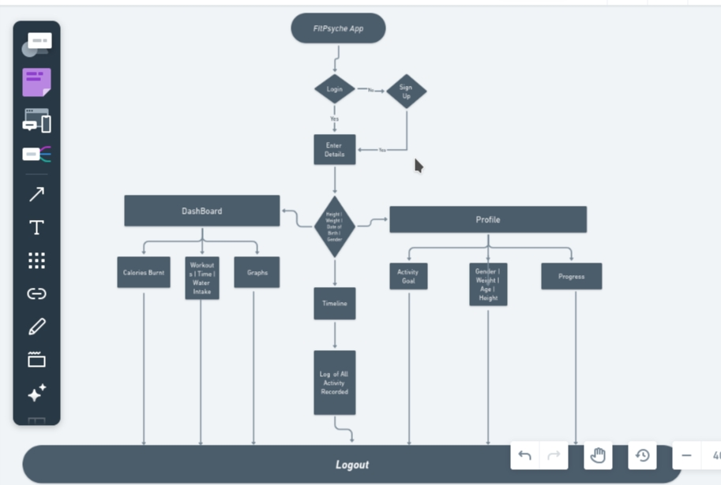
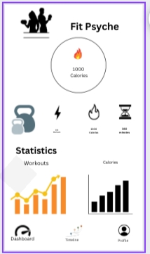
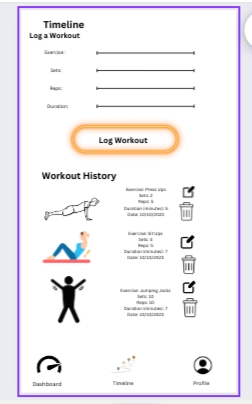
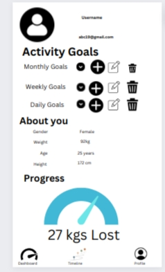

# FITNESS TRACKING APPLICATION

## TABLE OF CONTENTS

-  Introduction
-  Features
-  Technologies Used
-  Screenshots or Demo
-  Roadmap and Future Enhancements
-  Version Control System
-  Contact Information

## INTRODUCTION

-   The Fitness Tracker App emerges as a dynamic and essential tool to support people on their journey towards a healthier and more active lifestyle in a time when health and well-being are of the utmost importance. This state-of-the-art web app aims to empower users by giving them thorough insights into their daily physical activity, eating habits, and general health—all conveniently available at their fingertips.

- It can be difficult to maintain an active and healthy lifestyle in today's world. Jobs that require little movement, hectic schedules, and the allure of quick but frequently unhealthy food options can all contribute to health problems and a lack of motivation for exercise. The Fitness Tracker App tackles these problems head-on by providing a comprehensive approach that makes use of technology to advance health.
 

## FEATURES

### 1. User Logging Authentication

- *Description:* Users can have access to the app's functionality and personal data only if they are authorized. This promotes security, privacy and personalization of user data and interactions within the app. This enhances maintainance of trust and user confidence in the application

- *interaction:* Users can create an account, verify their email, log into the app, session management and logout
 

### 2. Workout Logging

- *Description:* Users can keep track of their fitness activities by logging their workouts, which can include cardio, strength training, and flexibility exercises.
- *Interaction:* Users can manually enter their workouts and enter information about the length, type, and intensity of their exercises.
 

### 3. Goal Setting and Tracking

- *Description:* Users can set fitness objectives like weight loss, muscle growth, or completing a certain distance while tracking their progress.
- *Interaction:* Using the app, users can set, edit, and see the progress of their goals while receiving notifications.
 

### 4. Sleep Analysis
- *Description:* To enhance sleep quality and comprehend their sleep cycles, users can monitor and analyze their sleep patterns.
- *Interactions:* Users can manually enter sleep data or enable sleep tracking on wearable devices to receive detailed sleep analysis reports.
 

### 5. Nutrition Tracking 
- *Description:* Users can track their daily food intake to keep tabs on their diet and learn more about their eating habits.
- *Interaction:* Users interact by entering meals and snacks, scanning barcodes for nutritional data, or selecting from a database of foods and recipes to keep a thorough food diary.
 

### 6. User's Progress Feature 
- *Description:* Users get valuable insights, motivation and clear understanding of their fitness and health journey through graphical representations. The visualizations make it easier for users to track their achievements, set new goals and make informed decisions regarding their health

- *Interaction:* Users get a dashboard overview of the calories burned and active minutes / history Progress Chart / Goal Progress Tracking through a bar or radial chart / Nutrition Summary / Sleep Patterns Analysis.
  

## TECHNOLOGIES USED 

* HTML/CSS: These are fundamental for creating the app's user interface and styling.

* JavaScript: To add interactivity, create dynamic charts, and handle user actions

* UI/UX Design Tools: Tools like Adobe XD, Sketch, or Figma for designing user interfaces.

* Server-Side Language: Python

* Web Framework: Flask
 

## Screenshots or Demo

- Flowchart screenshot

 
- Demo Prototype
<a href="https://www.canva.com/design/DAFw3bcxfcM/hme0ALUtCJEwyhDlPd8-0w/edit?utm_content=DAFw3bcxfcM&utm_campaign=designshare&utm_medium=link2&utm_source=sharebutton" alt="Prototype">

- if the three slides lack, the pictures attached below will give more details
* 

* 

* 

## ROADMAP AND FUTURE ENHANCEMENTS

- This roadmap outlines the future plans and potential improvements for the fitness tracker app, aiming to provide users with an even more comprehensive, personalized, and engaging fitness and health experience.
- The focus is on continuous development and innovation to meet the evolving needs and expectations of users.

### 1. Advanced User Authentication Features
This Features include:
* Two-Factor Authentication: This will enable the user to receive a one-time authentication via email or sms.

* Password Recovery: In case of a forgotten password, the user will select 'Forgot Password' or 'reset Password' option and the app will prompt the use to provide their registered email address for recovery purposes

* Password Reset: The user checks their email for the password reset link and clicks on it.The app verifies the link's validity and prompts the user to create a new password. The user enters a new password.
The app updates the user's password, and the user can now log in with the new credentials.

### 2. Smart Integration with Smart Home Devices:

Future Plan: Integrate with smart home devices like scales, blood pressure monitors, and smart fridges to provide comprehensive health and nutrition tracking.
Benefit: Allows users to track a wider range of health metrics seamlessly.

### 3. Voice Assistant Integration:

Future Plan: Incorporate voice assistant capabilities (e.g., Siri, Google Assistant) for hands-free interaction and data retrieval.
Benefit: Enhances user convenience during workouts and data queries.

### 4. Advanced Sleep Analysis:

Future Plan: Develop more advanced sleep analysis algorithms to provide detailed sleep quality assessments and sleep disorder detection.
Benefit: Offers users deeper insights into their sleep patterns and health.

### 5. Personalized Workout Plans:

Future Plan: Create a feature that generates personalized workout plans based on user goals, fitness level, and preferences.
Benefit: Helps users achieve their fitness goals more efficiently.

### 6. Community Expansion:

Future Plan: Expand the social and community features by introducing forums, interest groups, and user-generated content.
Benefit: Enhances user engagement and community-building within the app.

### 7. Enhanced Data Visualization:

Future Plan: Improve the visual representation of user progress with more interactive and customizable charts and graphs.
Benefit: Provides users with richer insights into their fitness journey.

### 8. Gamification Enhancements:

Future Plan: Enhance the gamification elements by introducing challenges, badges, and rewards for achieving milestones.
Benefit: Boosts user motivation and engagement.
.
### 9. Integration with Healthcare Providers:

Future Plan: Explore partnerships with healthcare providers to enable data sharing for more holistic health management.
Benefit: Facilitates better communication between users and their healthcare professionals.

### 10. Performance Optimization:

Future Plan: Regularly review and optimize the app's performance, ensuring it remains fast and responsive, even with increased user data.

### 11.Scalability Considerations:

Future Plan: Prepare the infrastructure for scalability to accommodate a growing user base and increasing data volumes.

### 12. Internationalization and Localization:

Future Plan: Offer the app in multiple languages and adapt it to different regional fitness preferences and cultures.

## VERSION CONTROL SYSTEM
* git

## CONTACT INFORMATION

If you have any questions, suggestions, or need assistance with the project, feel free to get in touch:

**Email:**   maurynnyakio19@gmail.com
**Github:**  https://github.com/Mauryn24
**Twitter**  https://twitter.com/MaurynNyakio